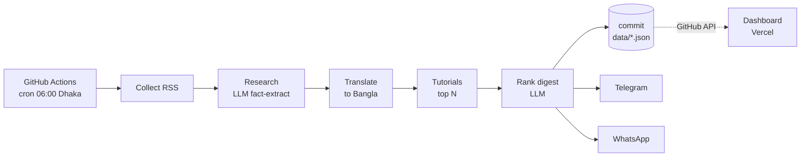

# AI Tech News Assistant


Collects the day's AI and tech news from ~20 curated sources, fact-checks
and summarizes each story with an LLM, translates it into natural Bangla,
writes a practical tutorial for the most important ones, ranks a daily
digest, and delivers it to Telegram and WhatsApp every morning at 06:00
(Asia/Dhaka). A Vercel dashboard shows today's digest, history, delivery
status, and lets you trigger a run on demand.

No local server required to operate it - the pipeline runs on GitHub
Actions' schedule and the dashboard reads data live from the repo.

## How it works



Full breakdown, design decisions, and repo layout: [docs/architecture.md](docs/architecture.md).

## Stack

| Layer | Tech |
|---|---|
| Pipeline & agents | Python 3.13, httpx (async), Loguru, uv |
| LLM | xAI Grok (`services/llm.py`) |
| Backend API | FastAPI, deployed to Vercel as a Python Function |
| Dashboard | Next.js 16 (App Router), TypeScript, Tailwind CSS v4, Recharts |
| Automation | GitHub Actions (4 scheduled workflows + CI) |
| Storage | JSON files committed to the repo - no database |
| Delivery | Telegram Bot API, Meta WhatsApp Cloud API |

## Repo structure

```
agents/        pipeline stages (trend, research, translator, tutorial, digest, telegram, whatsapp)
services/      RSS, dedupe, LLM client, storage, GitHub client, notify providers
prompts/       system prompts for each LLM-calling agent
backend/       FastAPI app powering the dashboard
frontend/      Next.js dashboard
scripts/       run_pipeline.py / healthcheck.py / cleanup.py entrypoints
data/          config.json (sources/schedule) + daily digests + history/logs/analytics
.github/       workflows + composite actions
docs/          everything below
```

## Documentation

- [Architecture](docs/architecture.md) - system diagram, design decisions, data flow
- [Installation](docs/installation.md) - run it locally
- [Deployment](docs/deployment.md) - the 2-Vercel-project setup
- [GitHub Secrets & Variables](docs/secrets.md) - what to configure and where to get each value
- [Workflows](docs/workflows.md) - what each GitHub Actions workflow does
- [API](docs/api.md) - every backend endpoint
- [Troubleshooting](docs/troubleshooting.md)
- [FAQ](docs/faq.md)

## Quick start

```bash
uv sync && uv run pytest -q        # backend + pipeline
cd frontend && npm install && npm run build   # dashboard
```

See [docs/installation.md](docs/installation.md) for running both together
locally, and [docs/deployment.md](docs/deployment.md) for shipping it.
