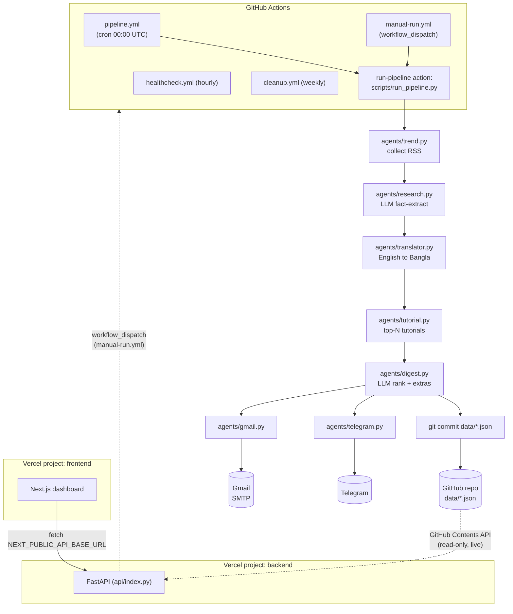

# Architecture

## System overview



## Why this shape

**No database.** `data/*.json` committed to the repo *is* the database. The
dashboard reads it live via the GitHub Contents API on every request - no
redeploy needed to see a fresh digest, no separate datastore to provision or
pay for. Tradeoff: dashboard reads are bounded by GitHub API rate limits
(5000 req/hr authenticated), which is far more than this traffic pattern
needs.

**One pipeline script, not N workflow files.** The original spec sketched
11 separate workflow files (one per stage). Collapsed to 4
(`pipeline`, `manual-run`, `healthcheck`, `cleanup`) because the stages are a
strict sequential pipeline within one process - splitting them across
workflows would mean passing state via artifacts for no benefit, since
nothing here runs on an independent schedule or needs independent retry.
`scripts/run_pipeline.py` orchestrates `agents/*` in-process; the workflow
YAML around it is a thin composite action (`.github/actions/run-pipeline`).

**Two Vercel projects, one repo.** The FastAPI backend (repo root,
`api/index.py`) and the Next.js dashboard (`frontend/`) deploy as separate
Vercel projects pointed at different Root Directories of the same repo. See
[deployment.md](deployment.md) for why, and setup steps.

**Tutorials capped, not unlimited.** The spec's own pipeline diagram puts
tutorial generation before digest ranking (implying "for every item"), but
generating a full step-by-step tutorial via LLM for every collected article
(50-200/day) would be expensive for little benefit - most never make the
digest anyway. `agents/tutorial.py` generates tutorials for the top N
(`max_tutorial_items` in `data/config.json`, default 25) by research
confidence, before digest ranking picks the final top 10/5.

**Freshness window is 96h, not 24h.** Several legitimate sources (DeepMind,
Azure's blog) post every few days, not daily. A tight 24-30h window silently
drops their news on every run that doesn't line up with a post. The digest
agent ranks by importance, not just recency, so a wider window is safe -
see `agents/trend.py`'s `MAX_AGE_HOURS`.

## Data flow, step by step

1. **Trigger**: `pipeline.yml` fires on cron (00:00 UTC = 06:00 Asia/Dhaka)
   or `manual-run.yml` fires on demand (dashboard "Run pipeline" button, or
   GitHub Actions UI).
2. **Collect** (`agents/trend.py`): fetch every configured RSS feed
   concurrently, drop items older than 96h, dedupe by fuzzy title match.
3. **Research** (`agents/research.py`): one Grok call per item, extracting
   only facts stated in the source; items scoring below 0.5 confidence are
   dropped rather than guessed at.
4. **Translate** (`agents/translator.py`): one Grok call per item, English
   summary to natural Bangla.
5. **Tutorial** (`agents/tutorial.py`): top N by confidence get a full
   what/why/how/resources tutorial; the rest pass through with
   `tutorial: null`.
6. **Digest** (`agents/digest.py`): one Grok call ranks everything into top
   10 AI / top 5 tech + the "today's extras" block (tip, prompt, tool, etc).
   Falls back to confidence-sorted ranking if the LLM call fails.
7. **Store**: `scripts/run_pipeline.py` writes
   `data/daily/{date}.json`, updates `data/history.json` (idempotent per
   date) and `data/logs.json` / `data/analytics.json`. The workflow's
   `commit-data` action commits and pushes.
8. **Send**: `agents/telegram.py` and `agents/gmail.py` format and
   deliver (unless `--skip-send`).
9. **Dashboard**: reads all of the above live from GitHub on each page
   load - see [api.md](api.md).

## Repo layout

```
.github/
├── actions/          composite actions shared by all 5 workflows
└── workflows/        pipeline, manual-run, healthcheck, cleanup, token-reminder, ci
agents/               one file per pipeline stage (see above)
services/             rss, dedupe, llm (Grok client), storage, github_client,
                       notify/ (Telegram + Gmail, behind one Protocol)
prompts/              system prompts, one per LLM-calling agent
backend/              FastAPI app (dashboard's read/trigger API)
api/index.py           Vercel entrypoint, re-exports backend.main:app
frontend/             Next.js dashboard (10 pages, see docs/api.md for what feeds them)
scripts/              run_pipeline.py, healthcheck.py, cleanup.py, notify_token_expiry.py
                       - the entrypoints GitHub Actions actually invoke
data/                 config.json (sources/schedule) + daily/*.json + history/logs/analytics
tests/                pytest - backend routes + pure pipeline logic
docs/                 this file, plus deployment/installation/secrets/workflows/api/troubleshooting/faq
```
